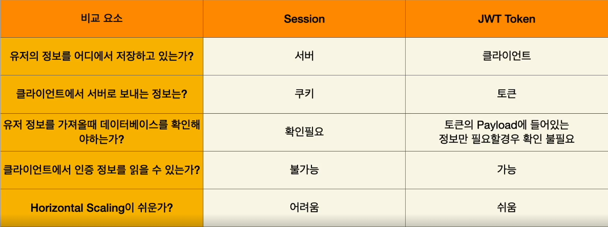

# nest js 프로젝트 시작하기

- nest new 프로젝트파일명
- nest g resource
- path명 (crud 어쩌구저쩌구나오면 n)

```
import {
  Body,
  Controller,
  Delete,
  Get,
  NotFoundException,
  Param,
  Post,
  Put,
} from '@nestjs/common';
import { PostsService } from './posts.service';

interface PostModel {
  id: number;
  writer: string;
  title: string;
  content: string;
  image?: string;
  likeCount: number;
  commentCount: number;
}

let posts: PostModel[] = [
  {
    id: 1,
    writer: '작성자',
    title: '글제목',
    content: '글내용',
    commentCount: 2,
    likeCount: 9,
  },
  {
    id: 2,
    writer: 'newjeans_fan',
    title: '뉴진스 민지',
    content: '뉴진스 민지의 무대 의상',
    commentCount: 21,
    likeCount: 92,
  },
  {
    id: 3,
    writer: 'newjeans_fan',
    title: '뉴진스 해린',
    content: '춤 연습하는 뉴진스 해린',
    commentCount: 4,
    likeCount: 5,
  },
];

// 1) get /posts
// 모든 posts를 다 가져온다

// 2) get /posts/:id
// id에 해당되는 post를 가져온다
// 예를 들어서 id =1 일 경우 id가 1인 포스트를 가져온다.

// 3 post /posts
// post생성한다

// 4 put /posts/:id
// id에 해당하는 포스트를 변경

// 5 delete /posts/:id
// id에 해당하는 포스트를 삭제

@Controller('posts')
export class PostsController {
  constructor(private readonly postsService: PostsService) {}

  // 1) get /posts
  // 모든 posts를 다 가져온다
  @Get()
  getPosts() {
    return posts;
  }
  // 2) get /posts/:id
  // id에 해당되는 post를 가져온다
  // 예를 들어서 id =1 일 경우 id가 1인 포스트를 가져온다.
  @Get(':id')
  getPost(@Param('id') id: string) {
    const post = posts.find((post) => post.id === Number(id));

    if (!post) {
      throw new NotFoundException();
    }

    return post;
  }

  // 3 post /posts
  // post생성한다

  @Post()
  postPosts(
    @Body('writer') writer: string,
    @Body('title') title: string,
    @Body('content') content: string,
  ) {
    const post = {
      id: posts[posts.length - 1].id + 1,
      writer,
      title,
      content,
      commentCount: 0,
      likeCount: 0,
    };

    posts = [...posts, post];

    return post;
  }

  // 4 put /posts/:id
  // id에 해당하는 포스트를 변경

  @Put(':id')
  putPost(
    @Param('id') id: string,
    @Body('writer') writer: string,
    @Body('title') title: string,
    @Body('content') content: string,
  ) {
    const post = posts.find((post) => post.id === +id);

    if (!post) {
      throw new NotFoundException();
    }
    if (writer) {
      post.writer = writer;
    }
    if (title) {
      post.title = title;
    }

    if (content) {
      post.content = content;
    }

    posts = posts.map((prev) => (prev.id === +id ? post : prev));
  }

  // 5 delete /posts/:id
  // id에 해당하는 포스트를 삭제

  @Delete(':id')
  deletePost(@Param('id') id: string) {
    const post = posts.find((post) => post.id === +id);

    if (!post) {
      throw new NotFoundException();
    }
    posts = posts.filter((post) => post.id !== +id);

    return id;
  }
}
```

# Dependency Injection , Inversion of Control

```
class A {
const b = B()
}

class B{}

A라는 클래스를 인스턴스를 만들때마다 A안에다가 클래스 B를 새로 생성한다.
```

class A{
constructor(instance:B)
}

class B{

}

# SQL기본기

- 데이터는 왜 초기화되는가?

  - hdd/ssd(영구적으로 저장) -> RAM(실행하는 데이터만 램에 올라감 프로그램이 재시작되면 리셋,하지만 속도가 빠름)
  - 그래서 프로그램이 종료되더라도 데이터를 유지하려면 HDD/SDD에 데이터를 작성해야함.
  - 가장 흔히 사용되는 방법이 SQL이다.

  # Docker 이론

- ### 같은 조건에서 같은 환경으로 항상 프로그램이 시작되도록 해당 컨테이너를 실행할 수 있도록 도와주는 도구
- nestjs 프로젝트를 하다보면 여러개의 컴퓨터에서 구동을 할 수 있어야함(팀협업, 배포 등)
- 멀티플랫폼(윈도우,맥,리눅스) 설치 절차가 대로 하면 프로그램이 시작하면 되는 것이 dockerfile
- 도커가 나온 이후 배포와 CI/CD 가 매우 쉬워짐

- 가상화(Virtual Machine) vs 도커(Docker)

  - 가상화 할경우 hypervisor가 올라감

- ### docker compose
- container가많아지면서 관리하기위해 kubernetes(쿠보네티스 점유율이 가장 높음), docker compose(여러개의 하드웨어에서 작동한다고 생각하고 만들어지지는 않은 기술임), docker swarm
- 단점 : docker compose만의 문법이 있음

- ### 설치
- docker,postgresql 익스텐션다운로드
- https://www.docker.com/products/docker-desktop/
- 실행이 안된다면 cmd 에서 wsl --update (윈도우 불법사용자는 업데이트가 안될 수 있음)
- https://hub.docker.com/_/postgres
- docker-compose.yaml 파일생성

```
services:
  postgres:
    image: postgres:15
    restart: always
    volumes:
      - ./postgres-data:/var/lib/postgresql/data
    ports:
      - '5432:5432'
    environment:
      POSTGRES_USER: postgres
      POSTGRES_PASSWORD: postgres
      POSTGRES_DB: postgres
```

- postgres-data 폴더생성
- 도커가 켜져있다면 터미널에서
- ### docker-compose up 명령어 입력
- ctrl+shift+p postgresql:add connection 입력후 위 유저 비번 db를 다 입력후 커넥션이름 설정후 좌측 익스텐션아이콘눌러서 확인

# typeorm 설치 및 세팅

- yarn add @nestjs/typeorm typeorm pg
- entities폴더생성
- posts.entity.ts 파일생성

```
import { Column, Entity, PrimaryGeneratedColumn } from 'typeorm';

@Entity()
export class PostsModel {
  @PrimaryGeneratedColumn()
  id: string;

  @Column()
  writer: string;

  @Column()
  title: string;

  @Column()
  content: string;

  @Column()
  likeCount: number;

  @Column()
  commentCount: number;
}

```

```
//app.module.ts
@Module({
  imports: [
    PostsModule,
    TypeOrmModule.forRoot({
      type: 'postgres',
      host: '127.0.0.1',
      port: 5432,
      username: 'postgres',
      password: 'postgres',
      database: 'postgres',
      entities: [PostsModel], // import한 entity는 여기에 입력하기
      synchronize: true,  // 개발환경에서는 자동싱크 true 배포환경에는 false로 하는게 나음
    }),
  ],
```

- repository 주입시키기
- repository는 DB와 브릿지 역할을 해줌

```
// posts.module.ts
  imports: [TypeOrmModule.forFeature([PostsModel])],
```

```
// posts.service.ts
  constructor(
    @InjectRepository(PostsModel)
    private readonly postsRepository: Repository<PostsModel>,
  ) {}
```

# Authentication
### session vs jwt token
- 
### session
- 유저의 정보를 데이터에 저장하고 상태를 유지하는도구
- 특수한 ID값으로 구성되어있음
- 서버에서 데이터가 저장되기때문에 클라이언트에 사용자 정보가 노출도리 위험이 없다.
### jwt token
- 유저의 정보를 base 64로 인코됭된 string 값에 저장하는 도구
- header payload signature 로 구성되어있음 
- 서버에서만 생성되고 클라이언트에 저장됨
- 클라이언트에 토큰을 저장하기 때문에 정보유출의 위험이 있음


